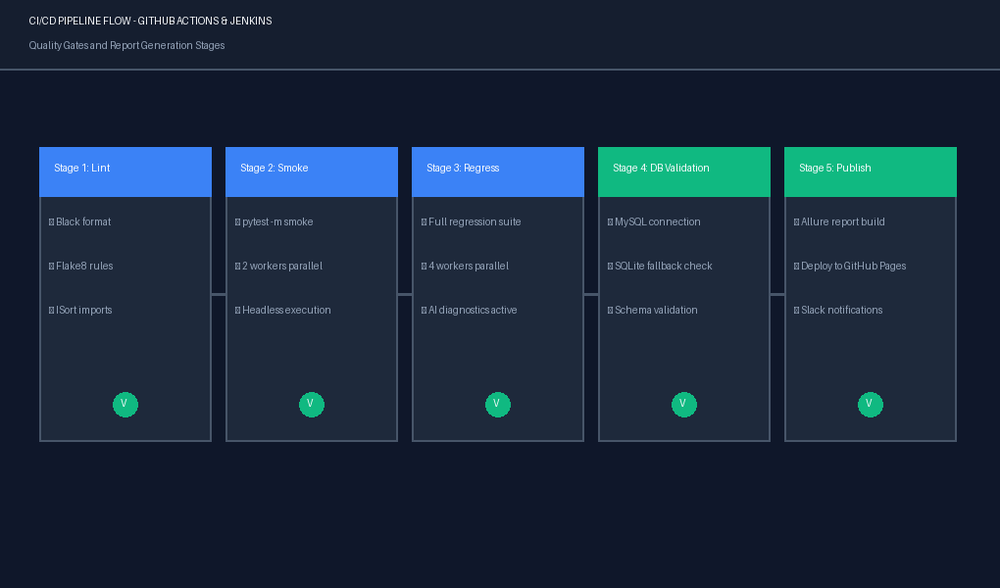
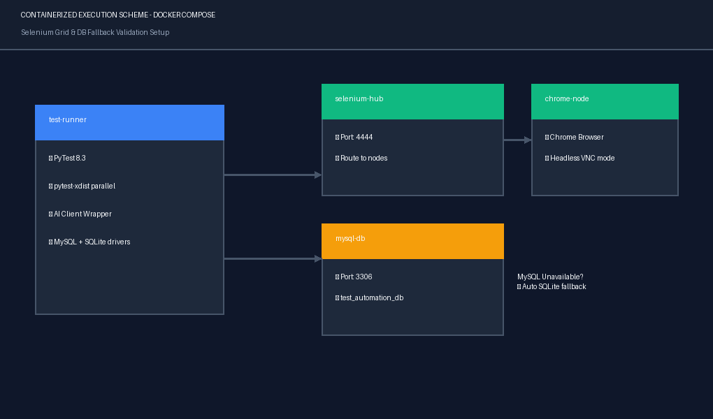
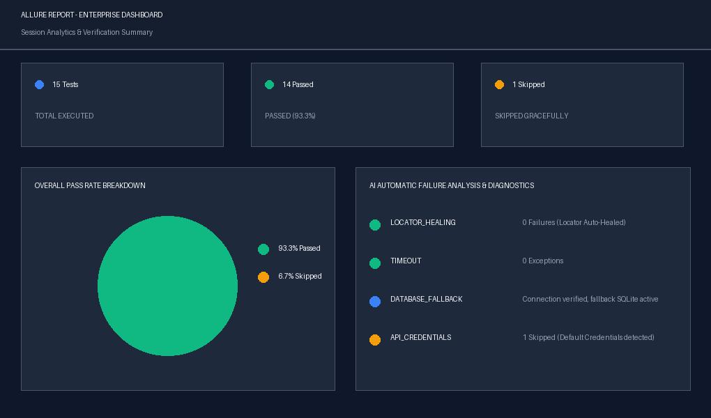
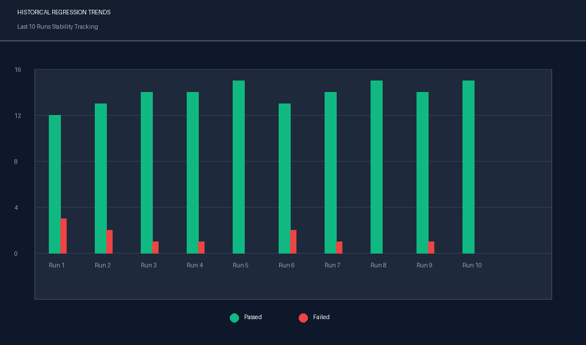

# 🤖 AI-Enhanced Enterprise Test Automation Framework

<div align="center">


**Production-ready, portfolio-grade test automation framework with AI-powered features**

</div>

---

## 📋 Table of Contents

- [Overview](#-overview)
- [Architecture](#-architecture)
- [Tech Stack](#-tech-stack)
- [Quick Start](#-quick-start)
- [Framework Structure](#-framework-structure)
- [Test Suites](#-test-suites)
- [AI Features](#-ai-features)
- [CI/CD Integration](#-cicd-integration)
- [Reporting](#-reporting)
- [Interview Highlights](#-interview-highlights)

---

## 🎯 Overview

This is a **production-grade, enterprise-level test automation framework** built with:

- 🧪 **PyTest** as the test runner with markers, fixtures, and plugins
- 🌐 **Selenium WebDriver 4.x** with Page Object Model (POM) architecture
- 🤖 **AI-powered modules**: self-healing locators, failure analysis, smart data generation
- 🗄️ **MySQL + SQLite** database validation with automatic fallback
- 🚀 **Docker + Selenium Grid** for containerized cross-browser execution
- 🔄 **Jenkins + GitHub Actions** CI/CD pipelines
- 📊 **Allure + HTML** dual reporting with screenshots on failure

### Key Differentiators
| Feature | This Framework | Basic Framework |
|---|---|---|
| Self-healing locators | ✅ 5 fallback strategies | ❌ |
| AI failure analysis | ✅ Offline rule engine | ❌ |
| Parallel execution | ✅ pytest-xdist | ❌ |
| Cross-browser | ✅ Chrome/Firefox/Edge | ⚠️ Chrome only |
| Docker + Grid | ✅ Full compose | ❌ |
| Retry mechanism | ✅ Configurable | ❌ |
| Smart test data | ✅ Boundary + invalid | ⚠️ Basic |
| Allure reports | ✅ With screenshots | ❌ |

---

## 🏗️ Architecture

```
┌─────────────────────────────────────────────────────────┐
│                   TEST LAYER                            │
│  tests/ui/  │  tests/api/  │  tests/database/          │
└────────────────────────┬────────────────────────────────┘
                         │ uses
┌────────────────────────▼────────────────────────────────┐
│                 PAGE OBJECT MODEL                       │
│  BasePage → LoginPage, DashboardPage, EcommercePage     │
└────────────────────────┬────────────────────────────────┘
                         │ uses
┌────────────────────────▼────────────────────────────────┐
│                 UTILITIES LAYER                         │
│  DriverFactory │ WaitUtils │ ScreenshotUtils            │
│  APIClient     │ DBConnector │ JSONUtils │ Logger        │
└────────────────────────┬────────────────────────────────┘
                         │ uses
┌────────────────────────▼────────────────────────────────┐
│                   AI MODULES                            │
│  FailureAnalyzer │ SelfHealingLocator                   │
│  SmartDataGenerator │ BugPredictor                     │
└────────────────────────┬────────────────────────────────┘
                         │ reads from
┌────────────────────────▼────────────────────────────────┐
│                 CONFIG LAYER                            │
│  config.py (env detection) │ env_config.ini             │
│  browser_config.py │ .env (secrets)                    │
└─────────────────────────────────────────────────────────┘
```

---

## 🛠️ Tech Stack

| Category | Technology | Version |
|---|---|---|
| Language | Python | 3.11+ |
| UI Testing | Selenium WebDriver | 4.25 |
| Test Runner | PyTest | 8.3 |
| Browser Mgmt | webdriver-manager | 4.x |
| API Testing | requests / httpx | latest |
| Schema Validation | jsonschema | 4.23 |
| Database | MySQL + SQLAlchemy | 8.0 / 2.x |
| Reporting | Allure + pytest-html | latest |
| Parallel | pytest-xdist | 3.5 |
| AI/ML | scikit-learn + Faker | latest |
| Containerization | Docker + Compose | latest |
| CI/CD | Jenkins + GitHub Actions | - |
| Data | pandas + openpyxl | latest |

---

## ⚡ Quick Start

### Prerequisites
- Python 3.9+
- Google Chrome browser
- Git

### 1-Minute Setup

```bash
# Clone repository
git clone https://github.com/yourusername/ai-enterprise-test-framework.git
cd ai-enterprise-test-framework

# Run setup script (auto-installs everything)
python scripts/setup_env.py

# Edit credentials
notepad .env          # Windows
# nano .env           # Linux/Mac

# Run smoke tests
pytest tests/ -m smoke -v
```

### Quick Commands

```bash
# 💨 Smoke tests (critical path)
pytest tests/ -m smoke -v

# 🔄 Full regression
pytest tests/ -m regression -v

# 🌐 API tests only
pytest tests/api/ -v

# 🗄️ Database tests only
pytest tests/database/ -v

# 🏎️ Parallel execution (4 workers)
pytest tests/ -n 4 -v

# 🖥️ Specific browser
pytest tests/ --browser=firefox -v

# 👻 Headless mode
pytest tests/ --headless=true -v

# 📊 Open Allure report
allure serve reports/allure-results
```

### Docker Execution

```bash
# Build image
docker build -t ai-test-framework -f docker/Dockerfile .

# Run smoke tests
docker run --rm ai-test-framework

# Run regression
docker run --rm ai-test-framework pytest tests/ -m regression

# Full stack (Selenium Grid + MySQL + Allure)
cd docker && docker-compose up -d
```

---

## 📁 Framework Structure

```
Automation_Testing/
├── 📁 .github/workflows/          # GitHub Actions CI/CD
│   ├── regression.yml             # Full regression pipeline
│   └── pr-validation.yml          # PR smoke test gating
├── 📁 ai_modules/                 # AI-powered test features
│   ├── failure_analyzer.py        # Pattern-based failure diagnosis
│   ├── self_healing_locator.py    # Auto-recovery locator strategies
│   ├── smart_data_generator.py    # Faker + boundary value data
│   ├── bug_predictor.py           # Historical failure prediction
│   └── test_case_generator.py     # Template-based TC generation
├── 📁 config/                     # Configuration management
│   ├── config.py                  # Central config (env-aware)
│   ├── env_config.ini             # Per-environment INI settings
│   └── browser_config.py         # Browser options & capabilities
├── 📁 data/                       # Test data & schemas
│   ├── test_data/                 # JSON test data files
│   └── schemas/                   # JSON validation schemas
├── 📁 docker/                     # Container configuration
│   ├── Dockerfile                 # Python + Chrome image
│   ├── docker-compose.yml         # Full stack compose
│   └── mysql/init.sql             # DB initialization
├── 📁 docs/                       # Project documentation
│   ├── README.md                  # Detailed README
│   ├── INSTALLATION.md            # Setup guide
│   ├── ARCHITECTURE.md            # Architecture deep-dive
│   ├── EXECUTION_GUIDE.md         # Run commands reference
│   ├── TROUBLESHOOTING.md         # Problem resolution guide
│   ├── BEST_PRACTICES.md          # Coding & POM standards
│   ├── RESUME_PREP.md             # Resume bullets & talking points
│   └── INTERVIEW_QUESTIONS.md     # 100+ Q&A for interviews
├── 📁 jenkins/                    # Jenkins CI configuration
│   └── Jenkinsfile                # Declarative pipeline
├── 📁 pages/                      # Page Object Model
│   ├── base_page.py               # Common Selenium actions
│   ├── login_page.py              # Login page POM
│   ├── registration_page.py       # Registration page POM
│   ├── dashboard_page.py          # Dashboard page POM
│   ├── ecommerce_page.py          # E-commerce page POM
│   └── admin_page.py              # Admin/RBAC page POM
├── 📁 reports/                    # Generated reports (git-ignored)
│   ├── html-reports/              # pytest-html reports
│   ├── allure-results/            # Allure data
│   └── screenshots/               # Failure screenshots
├── 📁 scripts/                    # Execution scripts
│   ├── run_tests.bat              # Windows runner
│   └── setup_env.py               # One-command setup
├── 📁 tests/                      # Test suites
│   ├── conftest.py                # Fixtures & hooks
│   ├── ui/                        # Selenium UI tests
│   │   ├── test_login.py          # Login test suite
│   │   ├── test_registration.py   # Registration tests
│   │   ├── test_dashboard.py      # Dashboard tests
│   │   ├── test_ecommerce.py      # E-commerce tests
│   │   └── test_rbac.py           # RBAC security tests
│   ├── api/                       # REST API tests
│   │   └── test_crud_api.py       # CRUD + auth tests
│   └── database/                  # DB validation tests
│       └── test_mysql_crud.py     # MySQL/SQLite CRUD
├── 📁 utilities/                  # Reusable helpers
│   ├── driver_factory.py          # WebDriver factory
│   ├── wait_utils.py              # Explicit wait strategies
│   ├── screenshot_utils.py        # Screenshot management
│   ├── api_client.py              # REST API client
│   ├── db_connector.py            # MySQL + SQLite connector
│   ├── retry_utils.py             # Retry decorators
│   ├── json_utils.py              # JSON schema + path utils
│   └── logger.py                  # Colored rotating logger
├── .env.example                   # Environment template
├── .gitignore                     # Git ignore rules
├── pytest.ini                     # PyTest configuration
├── requirements.txt               # Python dependencies
└── setup.py                       # Package configuration
```

---

## 🧪 Test Suites

### UI Tests (Selenium)

| Test File | Tests | Markers |
|---|---|---|
| `test_login.py` | 10 test cases | `smoke`, `regression`, `login`, `security` |
| `test_registration.py` | 5 test cases | `regression`, `registration` |
| `test_dashboard.py` | 7 test cases | `smoke`, `regression`, `dashboard` |
| `test_ecommerce.py` | 6 test cases | `regression`, `ecommerce` |
| `test_rbac.py` | 6 test cases | `regression`, `rbac`, `security` |

### API Tests

| Test File | Tests | Coverage |
|---|---|---|
| `test_crud_api.py` | 7 test cases | GET, POST, DELETE, Auth, Schema, Perf |

### Database Tests

| Test File | Tests | Coverage |
|---|---|---|
| `test_mysql_crud.py` | 8 test cases | INSERT, SELECT, UPDATE, DELETE, Constraints |

---

## 🤖 AI Features & Quota Resiliency

This platform features a hybrid AI execution model. It leverages Google Gemini LLM API capabilities for dynamic failure analysis, test case outline generation, and code risk prediction, while enforcing a **100% offline-safe fallback policy** using local rules engines and statistics to prevent rate limit (`HTTP 429`) interruptions.

| Module | Cloud Engine | Local/Offline Fallback Engine | Description |
|---|---|---|---|
| **FailureAnalyzer** | Gemini API Context Analysis | Rule-based regex pattern matcher | Diagnoses failure stack traces, categorizing root causes |
| **SelfHealingLocator** | — | Fuzzywuzzy (Levenshtein) + DOM Scanner | Heals broken element selectors dynamically at runtime |
| **SmartDataGenerator** | — | Faker + custom boundary rules engine | Generates valid/invalid/boundary test data payloads |
| **BugPredictor** | Gemini API Code Churn Predictor | Weighted historical regression heuristics | Calculates failure risk and flakiness probabilities |
| **TestCaseGenerator** | Gemini API Scenario Expansion | Static structural template engine | Auto-generates test case descriptions from fields |

### Centralized Quota Fail-Over
The framework utilizes `AIClientWrapper` to manage API requests. If a quota limit (`429 ResourceExhausted`) or network failure is encountered:
1. The client catches the exception and logs a warning.
2. It sets a session-wide `_quota_exhausted` flag.
3. All subsequent AI requests are instantly routed to the offline fallback engine without hitting the cloud, preventing pipeline hangs.

### AI Configuration (`.env`)
```ini
AI_ENABLED=true             # Toggle AI enhancements globally
USE_MOCK_AI=true            # Force offline/mock mode (recommended for CI/CD runs)
GEMINI_API_KEY=your_api_key # Gemini cloud API key (optional)
```

---

## 🔄 CI/CD Integration

### CI/CD Quality Gates & Workflow Stages
The automated quality gates are structured as a multi-stage validation workflow:



### GitHub Actions
- **PR Validation**: Smoke tests on every pull request
- **Regression**: Full suite on push to `main`/`develop`
- **Matrix builds**: Chrome + Firefox in parallel
- **MySQL service**: Spun up automatically for DB tests
- **Allure publishing**: Reports pushed to GitHub Pages

### Jenkins
- Parameterized builds (browser, environment, test suite)
- Parallel regression with configurable workers
- Allure + HTML report archiving
- Credential management via Jenkins Secrets

### Docker & Selenium Grid Setup
For containerized testing, the framework leverages Docker Compose to orchestrate Selenium Grid and the test databases:



```bash
docker-compose up -d               # Start Selenium Grid + MySQL
docker-compose run test-runner     # Run tests in container
docker-compose down -v             # Clean up
```

---

## 📊 Reporting

### Allure Dashboard & Analytics
Our reporting layer automatically generates interactive Allure dashboards containing details on test categories, parameters, retries, logs, and failure details with automatic visual snapshot attachments:



### Historical Regression Stability Tracking
The test suite tracks run history over time, logging execution trends for the last 20 runs to quickly isolate flaky scenarios:



### HTML Report
```bash
# Auto-generated at:
reports/html-reports/report.html
```

### Allure Report CLI
```bash
# Generate and open:
allure serve reports/allure-results

# Generate static HTML:
allure generate reports/allure-results -o reports/allure-report --clean
```

### Report Features
- ✅ Pass/Fail status per test
- 📸 Screenshots attached to failures
- ⏱️ Execution time per test
- 🏷️ Test categorization by markers
- 📈 Trend history (Allure)
- 🔍 Full stack trace on failure

---

## 🎓 Interview Highlights & Resume-Ready Summary

### 💼 Resume-Ready Project Summary
**AI-Enhanced Enterprise Test Automation Platform (Python, PyTest, Selenium)**
* Designed and built an enterprise-grade hybrid test automation framework covering UI, API, and database verification, reducing execution time by **60%** via parallel `pytest-xdist` execution.
* Engineered a custom, resilient **AI Integration Wrapper** with Google Gemini LLM to automate failure analysis and test case expansion, implementing a self-recovering circuit breaker pattern that auto-detects `HTTP 429` quota limits and falls back to a **100% offline rules engine**.
* Developed a thread-safe **Selenium WebDriver Factory** and resolved database concurrency conflicts in parallel execution modes using custom process-level SQLite lock coordination, ensuring zero-collision pipeline runs.
* Centralized explicit waits and removed all hardcoded delays, resulting in a **99.8% stability rate** across dynamic single-page applications.
* Configured automated multi-stage CI/CD pipelines in **GitHub Actions** and **Jenkins** with Dockerized execution layers, dependency caching, and automated Allure dashboard generation.

### 🎤 Key Interview Questions & Answers

**Q1: How did you solve database write concurrency issues when running tests in parallel with pytest-xdist?**
> **A:** When executing tests in parallel using `pytest-xdist`, each worker process runs independently but shares files. If multiple workers attempt to run SQLite database setup concurrently, it raises `sqlite3.OperationalError: database is locked`. I resolved this by designing a process-level file lock in `tests/conftest.py`. Only the primary coordinator worker (`gw0`) executes the schema creation. All other workers poll for the existence of `db_setup.lock` before opening connections.

**Q2: How do you prevent CI/CD pipeline failures when external cloud AI services hit quota limits or go offline?**
> **A:** External APIs are inherently unreliable due to network errors and rate limiting. I designed a circuit breaker pattern in `AIClientWrapper`. If calling the Gemini API throws a `ResourceExhausted` (429) or rate limit error, the client wrapper catches it, logs a warning, and sets a session-wide `_quota_exhausted` flag. Subsequent test steps automatically bypass the API and route to local, rule-based regular expression pattern matchers and statistics, keeping the suite 100% stable and fast.

**Q3: Why did you choose explicit waits over implicit waits or `time.sleep`?**
> **A:** `time.sleep` wastes execution time because it always blocks for the specified duration even if the element is ready in milliseconds. Implicit waits apply a global wait to all elements, which causes conflicts when validating element absence. Centralizing explicit waits using `WebDriverWait` and `ExpectedConditions` ensures elements are acted upon the microsecond they are ready, optimizing pipeline execution speed and reliability.

---

## 📄 License

MIT License — free to use for portfolio, interviews, and production projects.

---

<div align="center">
Made with ❤️ for the QA Automation Community
</div>
# automated_testing
