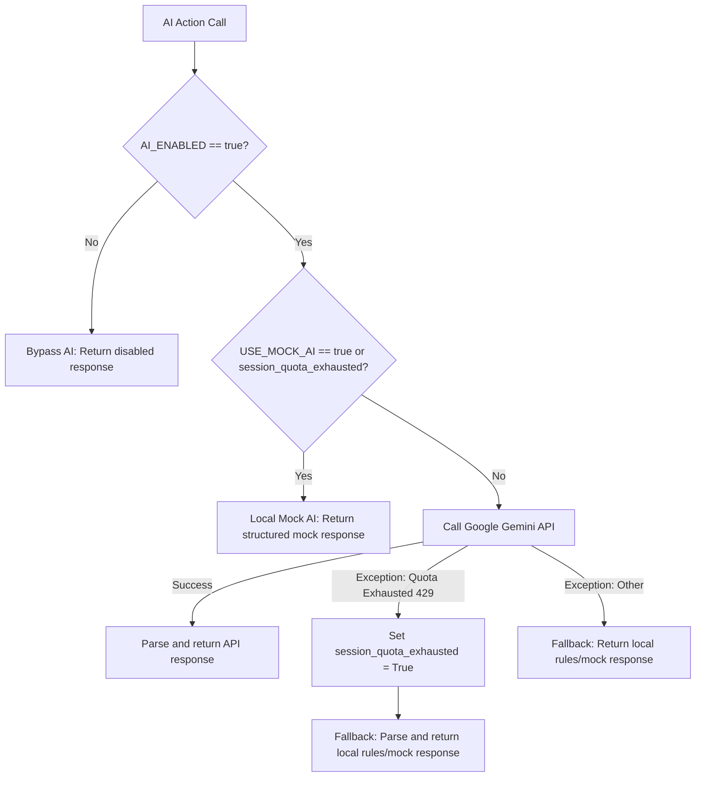
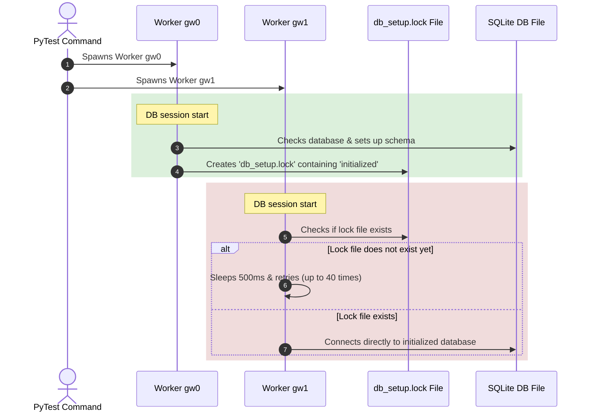

# 🏗️ Architecture Guide

Deep-dive into the technical design of the AI-Enhanced Enterprise Test Automation Framework.

---

## Layer Overview

```
┌──────────────────────────────────────────────────────────────────┐
│  EXECUTION LAYER                                                 │
│  Jenkins Pipeline │ GitHub Actions │ Docker Compose │ CLI        │
└─────────────────────────────┬────────────────────────────────────┘
                              │ triggers
┌─────────────────────────────▼────────────────────────────────────┐
│  TEST RUNNER LAYER                                               │
│  pytest + pytest-xdist (parallel) + pytest-rerunfailures        │
│  conftest.py: fixtures, hooks, CLI options                       │
└─────────────────────────────┬────────────────────────────────────┘
                              │ uses
┌────────────┬────────────────▼─────────────┬───────────────────────┐
│  UI TESTS  │   API TESTS                  │   DATABASE TESTS      │
│  tests/ui/ │   tests/api/                 │   tests/database/     │
│  Selenium  │   requests + jsonschema      │   SQLAlchemy          │
└────────────┴──────────┬──────────────────┴───────────────────────┘
                        │ use
┌───────────────────────▼──────────────────────────────────────────┐
│  PAGE OBJECT MODEL LAYER                                         │
│  BasePage → LoginPage, DashboardPage, EcommercePage, AdminPage   │
│  BasePage wraps ALL Selenium operations with waits + retry       │
└───────────────────────┬──────────────────────────────────────────┘
                        │ delegates to
┌───────────────────────▼──────────────────────────────────────────┐
│  UTILITIES LAYER                                                 │
│  DriverFactory │ WaitUtils │ ScreenshotUtils │ RetryUtils        │
│  APIClient     │ DBConnector │ JSONUtils     │ Logger            │
└───────────────────────┬──────────────────────────────────────────┘
                        │ enhanced by
┌───────────────────────▼──────────────────────────────────────────┐
│  AI MODULES LAYER                                                │
│  FailureAnalyzer │ SelfHealingLocator │ SmartDataGenerator       │
│  BugPredictor    │ TestCaseGenerator                             │
└───────────────────────┬──────────────────────────────────────────┘
                        │ configured by
┌───────────────────────▼──────────────────────────────────────────┐
│  CONFIGURATION LAYER                                             │
│  config.py (central) │ env_config.ini (per-env) │ .env (secrets) │
│  browser_config.py (capabilities)                                │
└──────────────────────────────────────────────────────────────────┘
```

---

## Component Deep-Dives

### 1. Configuration System

```
.env                    ← Machine-specific secrets (NEVER commit)
   ↓ overrides
env_config.ini          ← Per-environment defaults (committed)
   ↓ read by
config.py               ← Single source of truth, typed constants
   ↓ imported by
Everything else
```

**Environment Resolution:**
```python
# config.py priority chain:
BROWSER = (
    os.getenv("BROWSER")              # 1. CLI env var (highest)
    or pytest_option("--browser")     # 2. pytest CLI flag
    or ini_config["BROWSER"]          # 3. env_config.ini
    or "chrome"                       # 4. default (lowest)
)
```

**Why three layers?**
- `.env` — differs per machine (local dev vs CI vs staging)
- `env_config.ini` — differs per environment (dev vs staging URLs)
- `config.py` — single typed interface; no `os.getenv()` scattered in test code

---

### 2. WebDriver Factory

```python
class DriverFactory:
    _local = threading.local()   # Thread-safe: each worker gets own driver

    @classmethod
    def create_driver(cls, browser="chrome", headless=True) -> WebDriver:
        options = BrowserConfig.get_options(browser, headless)
        service = ChromeService(ChromeDriverManager().install())
        driver = webdriver.Chrome(service=service, options=options)
        cls._local.driver = driver
        return driver
```

**Key design decisions:**
- `threading.local()` → parallel-safe, no shared state between workers
- `webdriver-manager` → auto-downloads correct ChromeDriver, no manual install
- Selenium Grid support → same interface, different endpoint
- `quit_driver()` always called in fixture teardown, even on test failure

---

### 3. Page Object Model (BasePage)

```
BasePage
├── __init__(driver)          # Stores driver, initializes WaitUtils
├── navigate()                # Goes to page URL (abstract)
├── find(locator)             # SelfHealingLocator.find() with fallbacks
├── click(locator)            # Wait for clickable + click + retry
├── type_text(locator, text)  # Clear + send_keys
├── get_text(locator)         # Wait for visible + get text
├── safe_click(locator)       # JS fallback if regular click fails
├── wait_for_url(partial)     # URL contains condition
├── is_element_visible()      # Non-raising visibility check
├── scroll_to(locator)        # JS scrollIntoView
└── take_screenshot(name)     # ScreenshotUtils delegation
```

**Fluent interface pattern:**
```python
# Methods return `self` enabling chaining:
login_page \
    .enter_username("admin") \
    .enter_password("pass") \
    .click_login()
```

---

### 4. Wait Strategy Hierarchy

```
WaitUtils.wait_for_element_visible()    ← Most common (use this)
    → WebDriverWait(driver, timeout)
    → ExpectedConditions.visibility_of_element_located()
    → Polls every 500ms until timeout

WaitUtils.wait_for_element_clickable()  ← Before clicking
    → visibility + enabled check

WaitUtils.wait_for_staleness()          ← After page reload
    → staleness_of(old_element)

WaitUtils.fluent_wait()                 ← Custom polling interval
    → FluentWait(driver, poll_frequency=1s)
    → ignores NoSuchElementException during wait

WaitUtils.wait_for_page_load()          ← After navigation
    → document.readyState == "complete"
```

**Never use:**
```python
time.sleep(5)        # ❌ Always waits 5s
driver.implicitly_wait(10)  # ❌ Global, conflicts with explicit waits
```

---

### 5. Database Connector

```
DBConnector
├── _try_mysql_connect()     # Attempts MySQL connection
│   └── on failure → _connect_sqlite()  # Automatic SQLite fallback
├── execute_query(sql, params)    # INSERT/UPDATE/DELETE
├── fetch_one(sql, params)        # Returns dict or None
├── fetch_all(sql, params)        # Returns list[dict]
├── record_exists(table, col, val) # Boolean existence check
├── get_row_count(table, where)   # COUNT query
├── get_column_names(table)       # Schema introspection
├── setup_test_schema()           # Creates all test tables
└── teardown_test_data(tables)    # Cleanup after tests
```

**Automatic MySQL → SQLite fallback:**
```python
def _try_mysql_connect(self):
    try:
        engine = create_engine(mysql_url)
        engine.connect().close()   # Test connection
        self.db_type = "mysql"
        return engine
    except OperationalError:
        logger.warning("MySQL unavailable — using SQLite fallback")
        return self._connect_sqlite()
```

---

### 6. API Client

```
APIClient
├── get(path, params, headers)     # HTTP GET with retry
├── post(path, body, headers)      # HTTP POST
├── put(path, body, headers)       # HTTP PUT
├── delete(path, headers)          # HTTP DELETE
├── set_token(token)               # Sets Bearer auth header
├── clear_token()                  # Removes auth header
├── assert_status(response, code)  # Status assertion
├── assert_response_time(max_ms)   # Performance assertion
├── get_response_json(response)    # Parses JSON safely
└── validate_schema(data, schema)  # jsonschema validation
```

**Retry strategy:**
```python
retry_strategy = Retry(
    total=3,
    backoff_factor=0.3,         # 0.3s → 0.6s → 1.2s
    status_forcelist=[429, 500, 502, 503, 504],
)
```

---

### 7. AI Modules & Client Wrapper

The AI subsystem incorporates a hybrid cloud/offline model that uses `AIClientWrapper` to query Google Gemini (when configured) while enforcing a strict local fallback policy to keep builds completely offline-safe.



#### AIClientWrapper
Centralizes all LLM requests. It imports `google.generativeai` dynamically so that the system starts without failure even if dependencies are missing. If a `429` (Resource Exhausted) or server overload is encountered, the wrapper disables cloud calls for the rest of the session by raising a `_quota_exhausted` state.

#### SelfHealingLocator — Healing Chain
```
Primary locator fails
    ↓
Try explicit fallbacks (developer-provided)
    ↓
Auto-generate alternatives (ID↔CSS↔XPath conversion)
    ↓
Fuzzy text matching (fuzzywuzzy, min score 70)
    ↓
Attribute scan (aria-label, placeholder, data-testid)
    ↓
Raise NoSuchElementException + log all attempts
```

#### FailureAnalyzer — Pattern Categories
```
TimeoutException      → TIMEOUT       → Increase wait / check locator
NoSuchElementException → LOCATOR_ERROR → Update selector / enable healing
StaleElementRef       → STALE_ELEMENT → Re-find element / add retry
AssertionError        → ASSERTION     → Review expected values
ConnectionError       → NETWORK       → Check BASE_URL / server status
JSONDecodeError       → JSON_ERROR    → Check API response body
OperationalError      → DATABASE      → Check DB credentials / fallback
WebDriverException    → DRIVER_ERROR  → Update ChromeDriver / headless
401 / 403            → AUTH_ERROR    → Check credentials / token expiry
```

---

### 8. Fixture Dependency Graph

```
driver (function scope)
  └── login_page (function scope)
  └── registration_page (function scope)
  └── dashboard_page (function scope)
  └── ecommerce_page (function scope)
  └── admin_page (function scope)
  └── authenticated_dashboard (function scope)
        └── (uses driver + login_page internally)

api_client (session scope)  ← Created once, reused by all API tests

db (session scope)          ← Created once, auto MySQL→SQLite fallback
  └── clean_db (function scope)  ← Wraps db, truncates tables after test

login_test_data (session scope)   ← Loaded once from JSON
registration_test_data (session scope)
api_test_data (session scope)
```

---

### 9. Parallel Execution & SQLite Locking

When running tests in parallel (`pytest -n <N>` via `pytest-xdist`), each worker process executes in isolation. However, shared resources like the SQLite fallback database can experience write lock conflicts (`OperationalError`) during database schema creation if multiple workers attempt it simultaneously.

To resolve this bootstrap collision, we implement a process-level file lock:



**Coordination Protocol:**
Only the coordinator worker (`gw0`) is responsible for database schema setup. Other worker processes (e.g. `gw1`, `gw2`) pause execution and poll for the existence of `db_setup.lock` before connecting, guaranteeing lock-free parallel execution.

**Thread safety in DriverFactory:**
```python
class DriverFactory:
    _local = threading.local()    # Different object per thread/worker

    @classmethod
    def get_current_driver(cls) -> WebDriver:
        return getattr(cls._local, "driver", None)
```

---

### 10. CI/CD Pipeline Flow

```
Developer pushes code
        ↓
GitHub Actions triggers
        ↓
┌───────────────────────────────────┐
│  Job 1: Lint (always runs)        │
│  flake8 → black → isort           │
└───────────────┬───────────────────┘
                ↓ (if lint passes)
┌───────────────────────────────────┐
│  Job 2: Smoke Tests               │
│  pytest -m smoke --reruns=2       │
│  Chrome headless                  │
└───────────────┬───────────────────┘
                ↓ (if smoke passes)
        ┌───────┴────────┐
        ↓                ↓
┌───────────────┐  ┌─────────────────────┐
│ Job 3a: UI    │  │ Job 3b: API         │
│ Regression    │  │ Regression          │
│ Matrix: Chrome│  │ (no browser needed) │
│         Firefox│  │                     │
└───────┬───────┘  └──────────┬──────────┘
        └──────────┬───────────┘
                   ↓
        ┌──────────────────────┐
        │  Job 4: DB Tests     │
        │  MySQL service spun  │
        │  up automatically    │
        └──────────┬───────────┘
                   ↓
        ┌──────────────────────┐
        │  Job 5: Publish      │
        │  Allure → gh-pages   │
        │  Summary in PR       │
        └──────────────────────┘
```

---

## Key Design Principles

| Principle | Implementation |
|---|---|
| **DRY** | BasePage centralizes Selenium actions; config.py centralizes settings |
| **SOLID - SRP** | Each class has one responsibility (DriverFactory, WaitUtils, etc.) |
| **SOLID - OCP** | New browsers added via BrowserConfig without changing DriverFactory |
| **SOLID - LSP** | All page objects extend BasePage and can replace it |
| **Separation of Concerns** | Tests ≠ POM ≠ Utilities ≠ Config |
| **Test Isolation** | `scope="function"` driver; `clean_db` resets state |
| **Fail Fast** | Smoke tests gate regression in CI pipeline |
| **Offline First** | All AI modules work without external APIs |

---

## Security Considerations

- **No secrets in code** — all in `.env` (git-ignored)
- **Parameterized queries** — prevents SQL injection in DB tests
- **Credentials via CI secrets** — Jenkins Credentials / GitHub Secrets
- **Docker isolation** — tests run in isolated container, no host OS access
- **RBAC tests** — verify access control enforced by application
